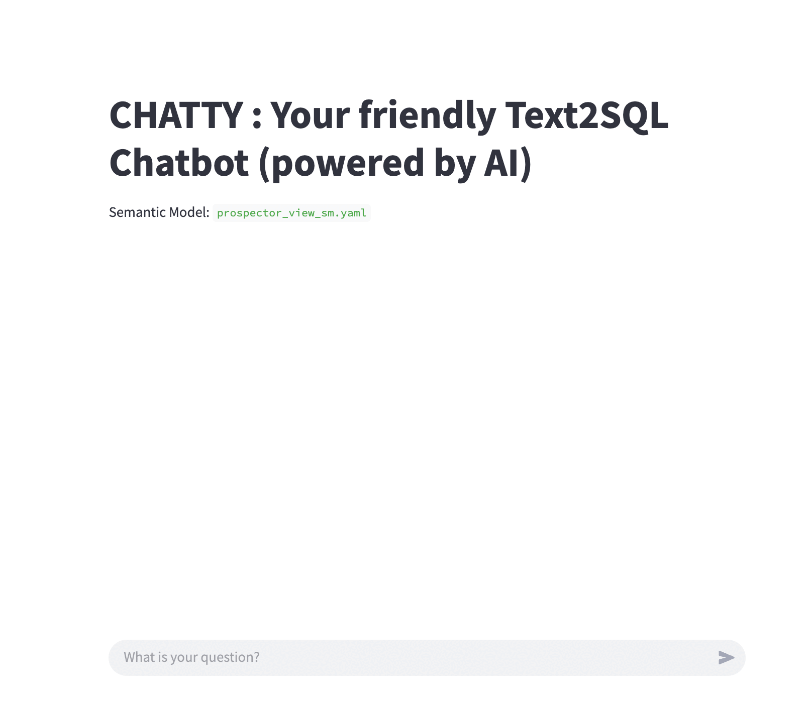

# Snowflake-AI
 Contains the AI queries for Snowflake

# 0. How to upload LLM models into Snowflake
You may upload your own LLM models in Snowflake stage. In my case, there was a models.zip (410 MB) file containing - tokenizer, pytorch_model.bin among other jsons. So I had to upload the zip to snowflake stage using SnowSQL. Why? because using the web UI, only 250 MB files can be uploaded. So used the PUT command to upload the models.zip
After this, you need to unzip the file in Snowflake notebook's working directory. Then you can use the pytorch_model.bin in your training code

# 1. Text2SQL AI chatbot (dbSchema approach)
Technologies: Snowflake Cortex, Python, Streamlit  
Text2SQL chatbot takes plain text english query, transforms that into a snowflake-compatible SQL & returns results  

# 2. Text2SQL AI chatbot (Semantic Model approach)
Technologies: Snowflake Cortex, Python, Streamlit  
Text2SQL chatbot takes plain text english query, transforms that into a snowflake-compatible SQL & returns results  

**Features:**  
1. Shows the interpretted Snowflake-compatible SQL (generated by LLM) for the given plain text query
2. Maintains conversational context history for past 'n' messages. 'n' is configurable

**Setup Instructions:**  
1. Create demo_sm.yaml file from the Snowsight UI (AI & ML > Cortex Analyst > Try > Create new). Select the tables & columns you want to have queries run on
2. The above step will also ask you to store the generated yaml file in a stage location. This stage location is used in the python code

**Run Instructions:**  
1. python -m venv streamlit-env
2. source streamlit-env/bin/activate
3. pip install -r requirements.txt
4. streamlit run analyst_demo.py

**Chatty App**  

# 3. Finetune LLM example
This notebook demonstrates the finetuning of 'mistral-7b' LLM model on a synthentically generated IT support tickets data. The idea is to match the results obtained on the classification of the tickets via the expensive 'mistral-large' model. The finetuned model is then used to re-classify the IT tickets albeit this time with matching performance with low cost.

# 4. RAG
Retrieval-Augmented Generation (RAG) is a framework that combines information retrieval with generative language models. In simpler terms, it's an approach that helps AI generate more accurate and up-to-date text by incorporating relevant information from external sources. In this tutorial, we use the foundation model from llama (llama2-70b-chat) to query a synthetically generated data about ergonomics. It demonsrates the use of vectors & vector cosine similarity to achieve RAG. The end result is a prioritised list of documents that match the query in descending order of similarity score.

# 5. AxLens
Check the detailed information in project level Readme
